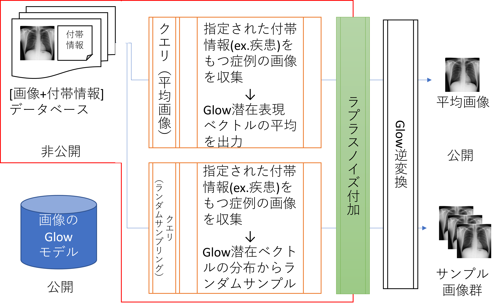
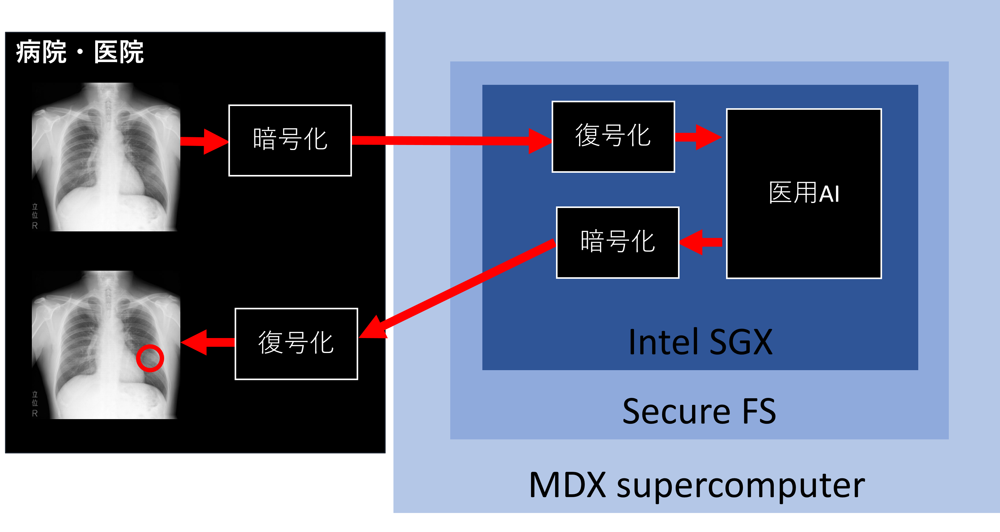

# [Privacy-Preserving Data Analysis and Secure Data Infrastructure for Real Applications](https://www.jst.go.jp/kisoken/crest/project/1111114/1111114_2021.html)

[Japanese](index.md) / [English](index_eng.md)

## Objectives

Our goal is to advance research in system software (data infrastructure, OS), data analysis (differential privacy, federated learning), and real-world applications (medical data, trajectory data) to alleviate concerns such as data leakage due to unauthorized accesses, innocent but leaky data extraction by legitimate users, and the identification of individuals (intentional or unintentional) from analysis results. We aim to contribute to the realization of a Society 5.0 that allows safe and proactive data utilization.

[This project](https://www.jst.go.jp/kisoken/crest/project/1111114/1111114_2021.html) has been adopted in the JST CREST field ["Creation of System Software for Society 5.0 by Integrating Fundamental Theories and System Platform Technologies"](https://www.jst.go.jp/kisoken/crest/en/research_area/ongoing/area2021-2.html).

## Team

* Principal Investigator
  * [Kenjiro Taura](https://www.eidos.ic.i.u-tokyo.ac.jp/~tau/) - The University of Tokyo Graduate School of Information Science and Technology, Department of Electronic Information
* Principal Research Collaborators
  * [Masatoshi Yoshikawa](https://www.db.soc.i.kyoto-u.ac.jp/~yoshikawa/) - Kyoto University Graduate School of Informatics, Department of Social Informatics
  * Shouhei Hanaoka - The University of Tokyo Hospital, Department of Radiology, Image Information Processing and Analysis Laboratory
  * [Toshihiro Hanawa](https://www.cspp.cc.u-tokyo.ac.jp/hanawa/) - The University of Tokyo Information Technology Center
  * [Yang Cao](https://yangcao88.github.io/) - Hokkaido University Institute of Information Science, Division of Information and Computer Science
* Collaborators
  * Kenjiro Taura Group
    * Osamu Tatebe
    * JIANG Renhe
    * Kento Aida
  * Shouhei Hanaoka Group
    * Shuichi Shibata - [DP-Glow](https://www.mdpi.com/2076-3417/13/18/10132)
    * Tomomi Takenaga - Local differential privacy protection for multi-dimensional medical checkup data: real-world validation (under review)
    * Alam MD Ashraful - Estimation of future occurrence of HbA1c elevation with and without Differential Privacy (under review)
    * Tomohiro Kikuchi @ Jichi Medical University Radiology Department - [Synthetic data generation method for hybrid image-tabular data using two generative adversarial networks.](https://arxiv.org/abs/2308.07573)
    * Yukihiro Nomura @ [Chiba University Nomura Laboratory](https://www.cfme.chiba-u.jp/staff/detail.php?index=nomura) - [DPSGD](https://1drv.ms/i/s!AsqSQ39DdrGCjagndybXE2nYbw9F-A?e=f16Qss)
    * Aiki Yamada @ [Chiba University Nomura Laboratory](https://www.cfme.chiba-u.jp/staff/detail.php?index=nomura) - Investigation of federated learning for automated cerebral aneurysm detection in head MR angiography images (presented in CARS 2023)

## Research Topics

* Many valuable data sources, such as medical data (diagnostic images, electronic health records, prescription data) and location data of individuals and objects, are based on personal information.
* Typically, such data is provided after removing personally identifiable information (pseudonymization, hashing) and used for purposes such as building machine learning models (e.g., constructing diagnostic models using a large number of normal and pathological images) and performing statistical calculations (e.g., calculating the number of users per period or per facility) without an intent to expose personal information.
* However, it is well-known that even in such cases, it is still possible to identify individual information by combining the analysis results (machine learning models or statistical data) with external knowledge about individuals, which poses a barrier to providing and using personal information for legitimate purposes.
* Additionally, current file systems and cloud storage solutions equate providing data and granting read access to data, making it difficult for systems to control the copying and leakage of read data. This also acts as a barrier to data provision.
* To address these issues, new system technologies are required, such as systems that limit the extent to which read data can leak and/or systems that prohibit leaking results that can identify individuals.
* In addition to these approaches, there are methods to anonymize data itself more thoroughly in such a way that it is impossible to recover personal information (e.g., K-anonymization and local differential privacy), but these methods come with the problem of significantly reducing the utility of the data.
* In this research, we address these issues at various levels (foundation software, algorithmic frameworks, practical applications) and collaborate on the following modules (all ongoing research with the possibility of changes in goals and approaches):

 1. Secure File System that Do Not Rely on Trustworthy Administrators
 2. System Mechanisms for Enforcing and Traceable Privacy Protection
 3. Flexible Privacy-Preserving Data Analysis and Machine Learning
 4. Demonstrations in Medical and Trajectory Data Applications

### Secure File System that Do Not Rely on Trustworthy Administrators

### System Mechanisms for Enforcing and Traceable Privacy Protection

* In this sub-theme, we research systems, specifically programming language processing systems, to prevent the output of analysis results that can identify personal information. We utilize the framework of (global) differential privacy to ensure that personal information cannot be identified from the analysis results.
* In the framework of global differential privacy, stochastic noise is added to the analysis results (e.g., averages or sums of a large number of individual data) to make the contribution of specific individuals to the results ambiguous, preventing the inference of individual data from the results.
* In the target language processing system:
   * Data based on personal information (inputs from files or databases) and data derived from calculations based on it are prohibited from being output.
   * Only data processed through appropriate global differential privacy mechanisms (with added stochastic noise) are allowed to be output, ensuring privacy protection.

### Flexible Privacy-Preserving Data Analysis and Machine Learning

In this sub-theme, we research the following topics:

- **Privacy-Preserving Federated Learning Using Trusted Execution Environments (TEEs)**

Combining federated learning (FL) with trusted execution environments (TEEs) is a promising approach to achieve privacy-preserving FL. Server-side TEE implementation enables FL to progress without exposing gradient information to the server during each round, particularly benefiting utility in FL using local differential privacy. However, considering the vulnerability of server-side TEE in the context of FL has not been sufficiently researched. In this sub-topic, we design systems and algorithms to analyze the vulnerability of TEE in FL, propose rigorous defense methods to enhance TEE, and develop systems that can utilize TEE for private and high-utility federated learning.

- **Privacy-Preserving Contribution Computation in Federated Learning**

Evaluating the contribution of each client's data is crucial in federated learning for applications such as data markets, explainable AI, or malicious client detection. Shapley value (SV) is a commonly used metric for contribution evaluation. However, existing methods for calculating SV in FL do not consider privacy. They assume that the server can access both unencrypted FL models and client data without privacy protection. Therefore, in this topic, we research privacy-preserving SV computation. We propose a protocol for efficient and private SV calculation, SecSV, for cross-silo FL. SecSV uses a hybrid privacy protection scheme to avoid ciphertext-ciphertext multiplication between test data and models. Experimental results show that SecSV is 5.9 to 18.0 times faster than the Baseline using homomorphic encryption.

### Demonstrations in Medical and Trajectory Data Applications

 1. Medical Sub-Theme
  * In the medical sub-theme, we primarily conduct three demonstrations:
  * Development, deployment, and practical use of privacy protection systems using differential privacy in medical settings.
  * Collaboration with Kenjiro Taura
  * Collaboration with Toshihiro Hanawa
  * Collaboration with Yang Cao

Here, the main goal is to establish AI learning methods that protect patient information used in AI learning while using the privacy enforcement technology developed by Kenjiro Taura. AI learning is carried out using the framework of differentially private stochastic gradient descent (DPSGD) to minimize the risk of patient information leakage.

  * Collaboration with Fumiharu Kato

In this collaboration, the focus is on the deployment side, specifically how to safely and scalably execute pre-trained AI and deliver the results to clinical practitioners and patients using secure computation and supercomputers.

## Publications

 1. Shang Liu, Yang Cao, Takao Murakami, Masatoshi Yoshikawa. "[A Crypto-Assisted Approach for Publishing Graph Statistics with Node Local Differential Privacy](https://doi.org/10.1109/BigData55660.2022.10020435)." _2022 IEEE International Conference on Big Data (Big Data)._ 2022.
 1. Shuyuan Zheng, Yang Cao, Masatoshi Yoshikawa, Huizhong Li, Yong Qiang. "[FL-Market: Trading Private Models in Federated Learning](https://doi.org/10.1109/BigData55660.2022.10020232)." _2022 IEEE International Conference on Big Data (Big Data)._ 2022.
 1. Ryota Hiraishi, Masatoshi Yoshikawa, Shun Takagi, Yang Cao, Sumio Fujita, Hidehito Gomi. "[Mitigating Privacy Vulnerability Caused by Map Asymmetry](https://doi.org/10.1007/978-3-031-10684-2_5)." _Springer eBooks._ 2022.
 1. Shun Takagi, Fumiharu Kato, Yang Cao, Masatoshi Yoshikawa. "[Asymmetric Differential Privacy](https://doi.org/10.1109/BigData55660.2022.10020709)." _2022 IEEE International Conference on Big Data (Big Data)._ 2022.
 1. 空閑 洋平, 中村 遼. "[遠隔会議システムの計測データを用いた広域ネットワーク品質計測 ](http://id.nii.ac.jp/1001/00222632/)." _インターネットと運用技術シンポジウム論文集 ._ 2022.
 1. Ruixuan Cao, Fumiharu Kato, Yang Cao, Masatoshi Yoshikawa. "[An Accurate, Flexible and Private Trajectory-Based Contact Tracing System on Untrusted Servers](https://doi.org/10.1007/978-3-031-21047-1_35)." _Lecture Notes in Computer Science._ 2022.
 1. Shuyuan Zheng, Yang Cao, Masayuki Yoshikawa. "[Secure Shapley Value for Cross-Silo Federated Learning](https://doi.org/10.14778/3587136.3587141)." _Proceedings of the VLDB Endowment._ 2023.
 1. Cao Xiao, Yang Cao, Primal Pappachan, Atsuyoshi Nakamura, Masatoshi Yoshikawa. "[Differentially Private Streaming Data Release Under Temporal Correlations via Post-processing](https://doi.org/10.1007/978-3-031-37586-6_12)." _Lecture Notes in Computer Science._ 2023.
 1. Ryota Hiraishi, Masatoshi Yoshikawa, Yang Cao, Sumio Fujita, Hidehito Gomi. "[Mechanisms to Address Different Privacy Requirements for Users and Locations](https://doi.org/10.1587/transinf.2023EDP7050)." _IEICE Transactions on Information and Systems._ 2023.
 1. Xiaoyu Li, Yang Cao, Masatoshi Yoshikawa. "[Locally Private Streaming Data Release with Shuffling and Subsampling](https://doi.org/10.1109/ICDEW58674.2023.00026)." _2023 IEEE 39th International Conference on Data Engineering Workshops (ICDEW)._ 2023.
 1. Shumpei Shiina, Kenjiro Taura. "[Itoyori: Reconciling Global Address Space and Global Fork-Join Task Parallelism](https://doi.org/10.1145/3581784.3607049)." _In Proceedings of the International Conference for High Performance Computing, Networking, Storage and Analysis (SC '23)._ 2023.
 1. Chao Tan, Yang Cao, Sheng Li, Masatoshi Yoshikawa. "[General or Specific? Investigating Effective Privacy Protection in Federated Learning for Speech Emotion Recognition](https://doi.org/10.1109/ICASSP49357.2023.10096844)." _ICASSP 2023 - 2023 IEEE International Conference on Acoustics, Speech and Signal Processing (ICASSP)._ 2023.
 1. Shun Takagi, Yang Cao, Yasuhito Asano, Masatoshi Yoshikawa. "[Geo-Graph-Indistinguishability: Location Privacy on Road Networks with Differential Privacy](https://doi.org/10.1587/transinf.2022DAP0011)." _IEICE Transactions on Information and Systems._ 2023.
 1. Ruixuan Liu, Yang Cao, Yanlin Wang, Lingjuan Lyu, Chen Yun, Chang Hong. "[PrivateRec: Differentially Private Model Training and Online Serving for Federated News Recommendation](https://doi.org/10.1145/3580305.3599889)." _KDD '23: Proceedings of the 29th ACM SIGKDD Conference on Knowledge Discovery and Data Mining._ 2023.
 1. Shun Takagi, Fumiharu Kato, Yang Cao, Masatoshi Yoshikawa. "[From Bounded to Unbounded: Privacy Amplification via Shuffling with Dummies](https://doi.org/10.1109/CSF57540.2023.00034)." _2023 IEEE 36th Computer Security Foundations Symposium (CSF)._ 2023.
 1. Fumiharu Kato, Yang Cao, Masayuki Yoshikawa. "[Olive: Oblivious Federated Learning on Trusted Execution Environment against the Risk of Sparsification](https://doi.org/10.14778/3603581.3603583)." _Proceedings of the VLDB Endowment._ 2023.
 1. Hisaichi Shibata, Shouhei Hanaoka, Yang Cao, Masatoshi Yoshikawa, Tomomi Takenaga, Yukihiro Nomura, Naoto Hayashi, Osamu Abe. "[Local Differential Privacy Image Generation Using Flow-Based Deep Generative Models](https://doi.org/10.3390/app131810132)." _Applied sciences._ 2023.
 1. Cao Xiao, Yang Cao, Primal Pappachan, Atsuyoshi Nakamura, Masatoshi Yoshikawa. "[Differentially Private Streaming Data Release Under Temporal Correlations via Post-processing](https://doi.org/10.1007/978-3-031-37586-6_12)." _Lecture Notes in Computer Science._ 2023.
