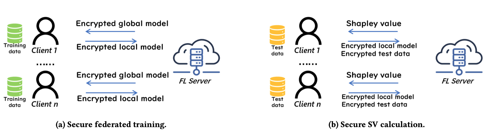

## 柔軟なプライバシー保護データ解析・機械学習 

このサブテーマでは、以下の項目を研究する．

-  **TEEを用いるプライバシー保護型連合学習**

連合学習（FL）と信頼実行環境（TEE）を組み合わせることは，プライバシーを保護するFLを実現するための有望なアプローチであり，近年，かなりの学術的注目を集めている．サーバー側でTEEを実装することにより，各ラウンドがサーバーに勾配情報を露出することなく連合学習が進行することを可能にする．これは，特に局所的差分プライバシーを用いるFLのユーティリティの増加に約立つ．しかし，サーバー側TEEの脆弱性を考慮する必要があるが，これはFLの文脈で十分に研究されていない．このサブトピックでは，FLにおけるTEEの脆弱性を分析するためのシステムとアルゴリズムを設計し，TEEを強化するための厳密な防御方法を提案し，プライベートかつ高ユーティリティな連合学習にTEEを活用できるシステムの開発を行う．

- **連合学習におけるプライバシー保護した貢献度の計算**

連合学習には，各クライアントのデータの貢献度を評価することは重要な課題であり，データ市場，説明可能なAI，または悪意のあるクライアントの検出に応用される．特に，シャープレイ値（SV）は，貢献度評価のためのよく使われた指標である．しかし，既存のFLにおけるSV計算方法は，プライバシーに配慮していない．つまり，既存手法は，サーバーがプライバシー保護されていないFLモデルとクライアントのデータにアクセスできると仮定している．したがって，本トピックでは，プライバシー保護されたSV計算の問題について研究する．我々は，Cross-silo FLにおいて，初めて効率的かつプライベートなSV計算プロトコル，SecSV，を提案した．SecSVの特徴は，ハイブリッドプライバシー保護スキームを利用して，テストデータとモデル間の暗号文-暗号文の乗算を避ける．実験では，SecSVが同型暗号を使用するBaselineよりも5.9-18.0倍速いことを示している．

## 医療・軌跡データ実応用での実証

## 医療・軌跡データ実応用での実証

２．軌跡データサブテーマ

